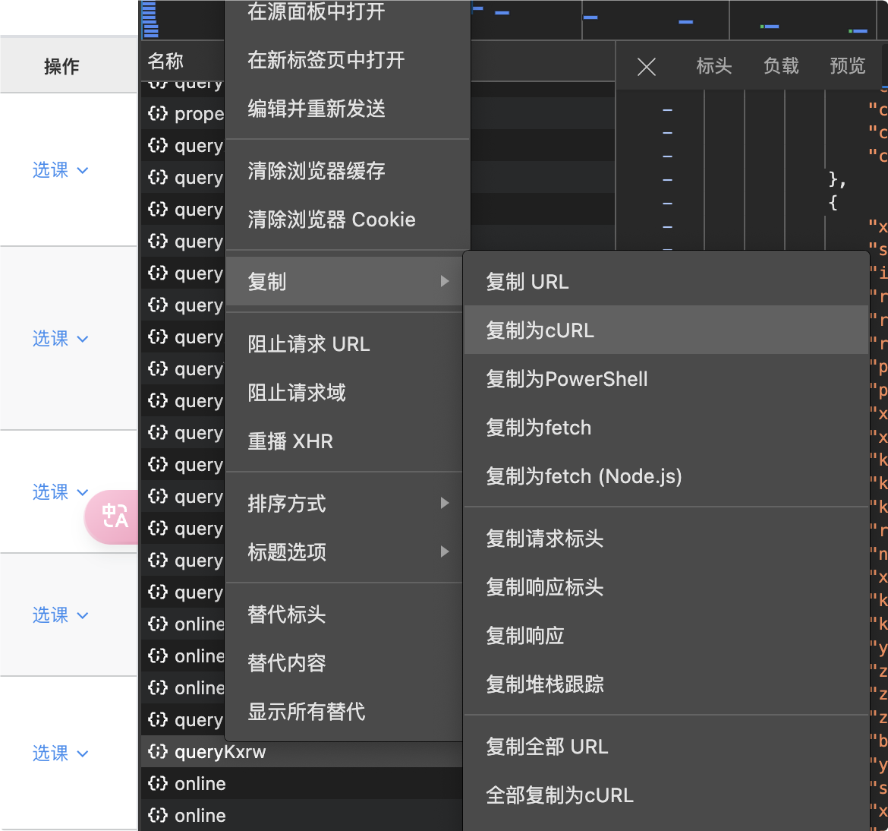
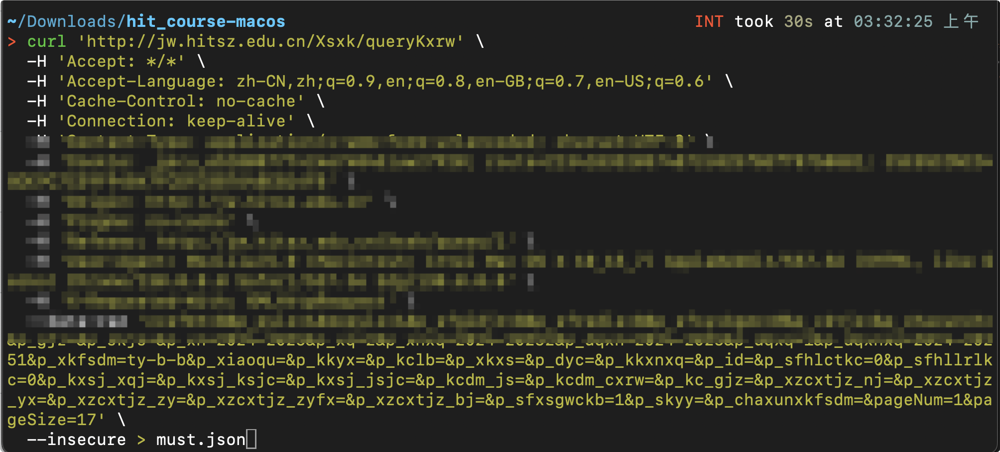

# HITSZ 抢课小脚本

## YinMo19

**请注意！由于神秘的教务系统，本脚本可能没用。**

## 使用方法

在本仓库的 [Releases](https://github.com/YinMo19/hit_course/releases) 中选择对应系统的文件进行下载，下载得到的压缩包里面有两个可执行文件，分别是 `hit_course` 和 `req_auth`。

`hit_course` 需提前准备好课程信息和 cookie，直接对应请求进行选课；而 `req_auth` 则是直接请求鉴权，通过本研账号和密码从头开始走一遍验证，然后选课。

### hit_course

使用 `hit_course` 需要提前准备课程的 `.json` 文件，放在 `all_courses` 文件夹内，例如：

```
all_courses/<your courses>.json
```

课程 `.json` 文件的获取方式：

可以直接在浏览器中打开 `f12` ，选中 `网络`，然后点击必修课程（或其他课程），点击选课后能够看到一条请求。将这条请求复制为 `cURL`:

然后将命令粘贴到命令行，追加 ` > <your courses>.json`，例如：



就可以将课程信息写入一个 `.json` 文件了。之后将这个 `.json` 文件放到 all_courses 下面即可。

说明：若未到选课时间，选课按钮为灰色，则按 `f12` 打开控制台，右键选课的按钮，选择“检查”找到对应的代码位置，删掉 `disabled` 相关的代码，按钮即可变为可点击的状态。然后再次点击选课按钮，即可在 `网络` 中看到对应的请求。

`hit_course` 使用方法：

复制你的 `cookie`（可以从上面复制的命令请求头里面找到），用双引号引出，然后使用：

```bash
./hit_course --cookie <your cookie>
```

就可以开始选择你要抢的课了，例如：

```bash
.\hit_course.exe -c "route=<your route>; JSESSIONID=<your JSESSIONID>"
```

需要注意的是，推荐在抢课前提前将上述导入课程 `.json` 的步骤做好，否则在抢课的时候你可能甚至没法登陆看到这些课程的内容。

### req_auth

这个程序直接请求鉴权，通过本研账号和密码从头开始走一遍验证，使用会简单一些，但是对于抢课高峰期时鉴权死掉的系统就没啥用了（经过尝试，在抢课高峰期官网登不上时本程序有更大的可能性成果登上，所以可以一试）。

直接在命令行输入：

```bash
./req_auth -h
```

就能看到帮助文档，简单易用。使用方法为：

```bash
./req_auth -u <your username> -p <your password>
```

## 自己构建

使用 rust 编写，在 linux 系统上可能需要安装 openssl 依赖。关于如何安装 rust 环境这里不多说，构建方法为：

```bash
cargo build --release
cargo build --example req_auth --release
```

如果用不了，可以考虑去源码中更改对应的请求体，因为教务本身请求体非常丑陋（全都是不明所以的拼音缩写），我看不懂，所以基本上就是替换关键词。
